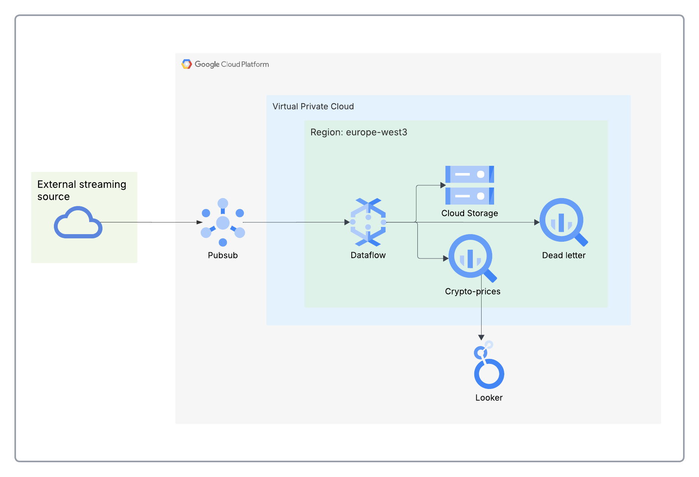
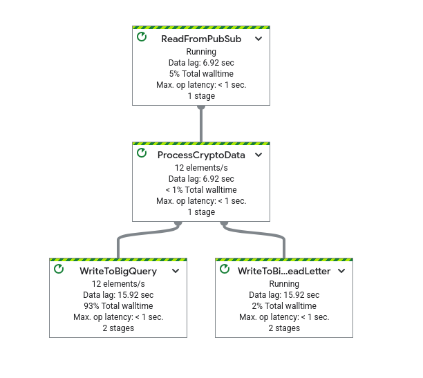
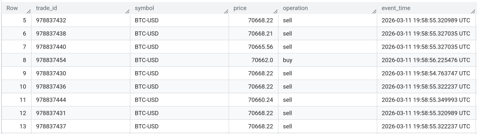
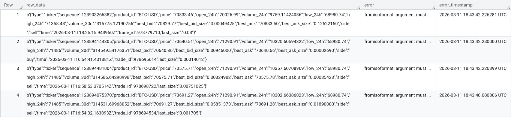

# Real-Time Crypto Data Pipeline (GCP)

This project implements a **real-time data processing pipeline** that ingests cryptocurrency market data, processes it using a streaming pipeline, and stores it for analytics.

The system is built using **Google Cloud Platform managed services** and follows a modern streaming data architecture.

---

## Architecture Overview

The pipeline processes streaming crypto price events in real time.

Data flow:

Crypto Stream Producer  
→ Pub/Sub  
→ Dataflow (Apache Beam pipeline)  
→ BigQuery  
→ Analytics / SQL queries



---

## Technologies Used

* Python
* Apache Beam
* Google Cloud Dataflow
* Google Cloud Pub/Sub
* Google BigQuery
* Google Cloud Storage

---

## Repository Structure

│  
├── src  
│ ├── crypto_pipeline.py  
│  
├── requirements.txt  
│  
├── architecture  
│ └── architecture.md  
│  
└── README.md  

---

## Data Pipeline

The pipeline performs the following steps:

1. **Ingest streaming data** from Pub/Sub
2. **Parse JSON messages**
3. **Validate and transform events**
4. **Write structured data to BigQuery**

Example of the received event:   
``` JSON
{
"type":"ticker",
"sequence":123894075370,
"product_id":"BTC-USD",
"price":"70691.27",
"open_24h":"71290.91",
"volume_24h":"10302.66386023",
"low_24h":"68980.74",
"high_24h":"71485",
"volume_30d":"314531.69968052",
"best_bid":"70691.27",
"best_bid_size":"0.05851373",
"best_ask":"70691.28",
"best_ask_size":"0.01890000",
"side":"sell",
"time":"2026-03-11T16:54:02.163093Z",
"trade_id":978694534,
"last_size":"0.001705"
}
```
Example of the data after preprocesing (DoFn)
``` JSON
{
"trade_id":978694534,
"symbol": "BTC-USD", 
"price": 64210.12, 
"operation": "sell",
"timestamp": "2026-03-10T14:00:00Z"
}
```
---

## BigQuery Table Schema

| Field | Type |
|-----|-----|
| trade_id | STRING |
| symbol | STRING |
| price | FLOAT |
| operation | STRING |
| event_time | TIMESTAMP |
| processing_time | TIMESTAMP |

---

## Running the Pipeline

### Install dependencies

`pip install -r requirements.txt`

### Run locally

`python crypto_pipeline.py --runner DirectRunner`

### Deploy to Dataflow
Use the command below to submit the pipeline to cloud.  Provide a name to easily identify your pipeline job by replacing `PIPELINE_NAME`, otherwise, Dataflow will set a random unfriendly name. You can use the same bucket for `--temp_location` and `--staging_location` but create different folders for each one.
``` bash
python crypto_pipeline.py \                                                                                                         
 --runner DataflowRunner \
 --project <YOUR_PROJECT_ID> \
 --region <YOUR_REGION> \
 --temp_location <YOUR_BUCKET>/temp \
 --staging_location <YOUR_BUCKET>/staging \
 --max_num_workers 1 \
 --worker_machine_type e2-standard-2 
 --job_name=<PIPELINE_NAME>
```
> [!IMPORTANT]
> The error *ZONE_RESOURCE_POOL_EXHAUSTED* is a common error related to availability of resources in the selected region. Try to run the pipeline in a [different zone](https://docs.cloud.google.com/compute/docs/regions-zones), even if it is different to the zone chosen for the project, but not too far, at least not an intercontinental region, to avoid high charges. Other alternative is to use a different type of machine for `worker_machine_type` parameter. 

---

### Graphs


*The pipeline graph*


*The sink as a BQ table*


*The dead letter sink as a BQ table*

---

## Example Analytics Query
``` SQL
SELECT
symbol, 
AVG(price) as avg_price
FROM prices
WHERE event_time > TIMESTAMP_SUB(CURRENT_TIMESTAMP(), INTERVAL 5 MINUTE)
GROUP BY symbol
```
---

## Use Cases

This architecture can be used for:

* Real-time financial analytics
* Market monitoring
* Trading dashboards
* Streaming anomaly detection

---

## Future Improvements

Possible improvements to the pipeline:

* ~Add data validation~
* ~Implement dead-letter queues~
* Add monitoring and alerting
* Add ML-based anomaly detection
* Add Terraform
