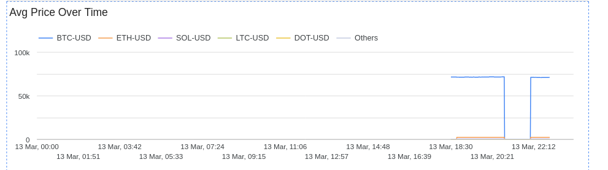
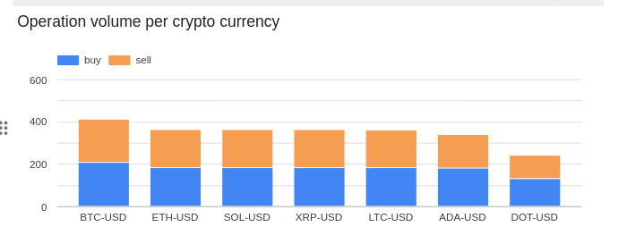
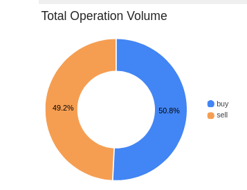
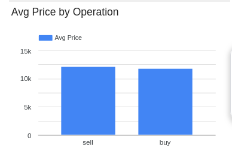

# Analytics Dashboard

A real-time dashboard was created using **Looker Studio** to visualize cryptocurrency price trends.

The dashboard includes:

- Price per minute (trend over time)
- Volume operations per crypto currency (Buy vs Sell)
- Market Sentiment (Buy vs Sell ratio)
- Average price by Operation
- Percentage of operations per crypto currency

The dashboard is powered by a BigQuery analytics view that aggregates streaming data by minute.

```SQL
CREATE OR REPLACE VIEW `crypto-prices-22175.cryptos.crypto_price_analytics_minute` AS
SELECT
  symbol, operation, 
  TIMESTAMP_TRUNC(event_time, MINUTE) AS minute,
  AVG(price) AS avg_price
FROM `crypto-prices-22175.cryptos.prices` 
GROUP BY symbol, operation, minute
```

## Price per minute (trend over time)

**Configuration**
- Type: Time series
- Dimension: `minute` 
- Breakdown dimension: `symbol` 
- Metric: `avg_price` 



**Shows**
1. Market trends and price evolution 
2. How market is reacting

## Volume operations per crypto currency (Buy vs Sell)

**Configuration**
- Type: Stacked Bar Chart
- Dimension: `minute` 
- Breakdown: `operation` 
- Metric: `COUNT(symbol)` 



**Shows**
Buy vs sell volume

## Market Sentiment (Buy Vs Sell Ratio)
- Type: Pie chart
- Dimension: `operation` 
- Metric: `COUNT(symbol)`



**Shows**
Market sentiment

## Average price by operation

- Type: Bar chart
- Dimension: `operation`
- Metric: `AVG(avg_price)`



**Shows**
How different are the buy prices vs sale prices


